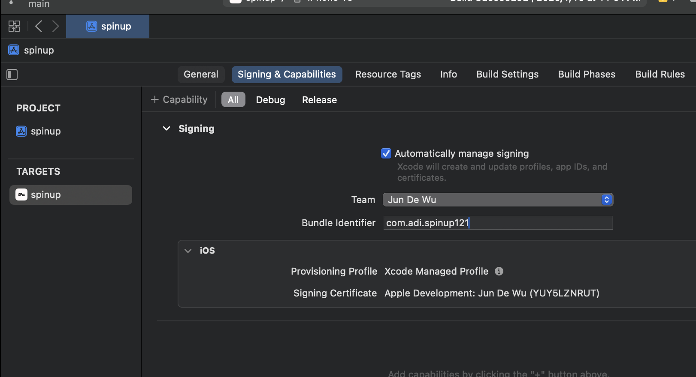
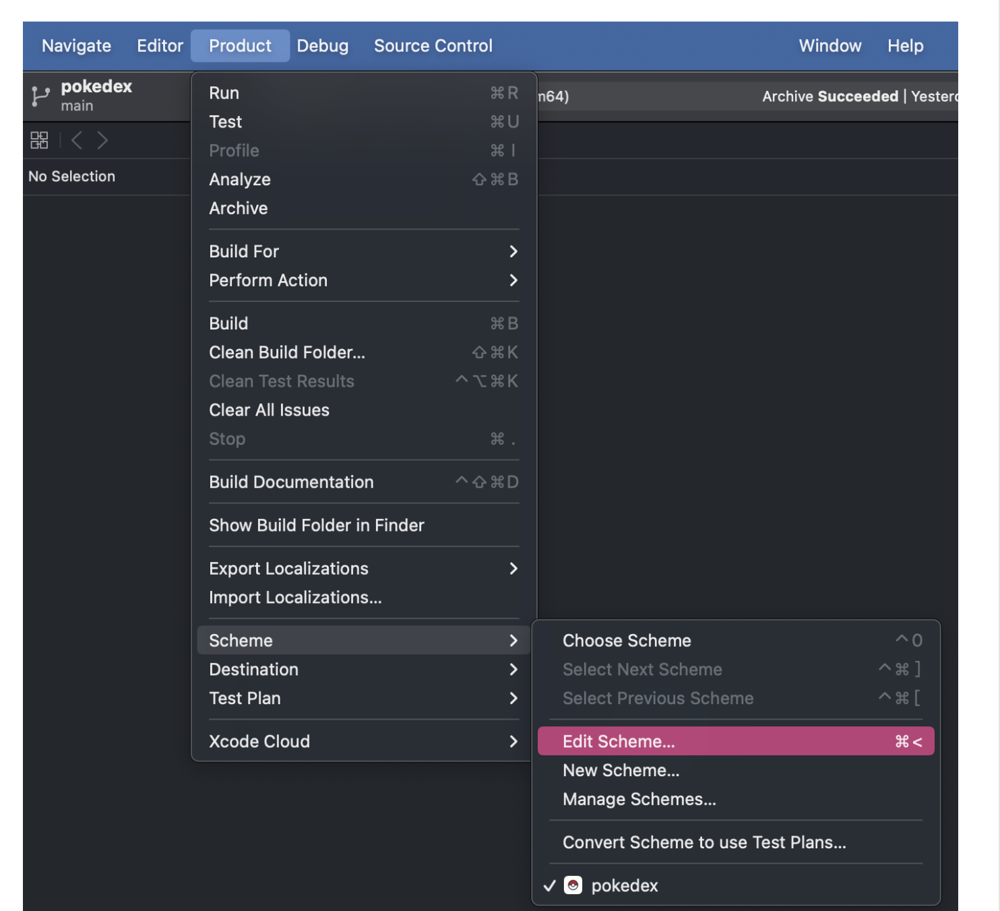
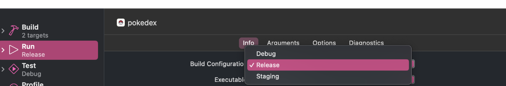

# wheel spinpper app 

颱風假開發的小app。
幫助我們可以在選擇晚餐要吃什麼可以更順暢，保護情侶的感情。

## Features

- **Customizable Content**: Add your own items to the wheel.
- **Spinning Effects**: Choose from different spinning animations.
- **User-friendly Interface**: Easy to use and interact with.
- **SwiftUI Integration**: Built using SwiftUI for seamless performance.

## develop log book

**20241003**
- [x] icon設定
- [x] 上傳到開發手機測試

**todo**
- [ ] 儲存：可以目前已知的參數存儲
- [ ] ...功能：開啟關閉選項移除，ui轉盤固定，按下...顯示其他儲存的設定
- [ ] 儲存參數：可以編輯已儲存的設定 

1. 圖片資源不大也沒有變動需求, 先直接打包進app
2. 處理自定義圖片的自動化需求
    a. 把轉盤的圖拆解, 邊界, 每個區塊的線條

### App store 上 testflight

1. 先有apple開發者會員, 建立app, 設定資料
> bundle id 唯一 反域名寫法, apple識別app的key
2. xcode 設定
> 登入apple id, 選擇app
> windows > device and simulator 選擇要測試的裝置, 這邊會有裝置的identifier 記錄下來, 該處因為我之前就已經有有線連過, 不確定如果沒連過要怎麼測餓

- 選擇singin & capabilities, team選擇appleid建立的team, bundle id填上跟app store設定的bundle id一樣, 這邊有遇到一些問題, 需要到https://developer.apple.com/account/resources/devices/edit/S4CS7UM3CJ 設定device唯一識別符. 

- 到這裡 選info, 選擇 debug

- Product > build 執行

## tools 

- format: swimat

## 參考資料
https://ithelp.ithome.com.tw/articles/10330724